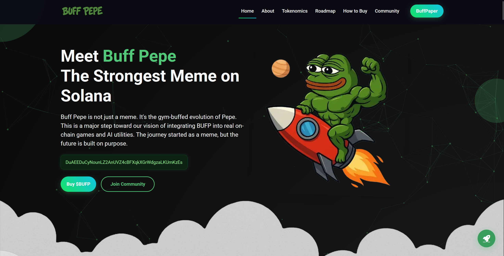

# 🐸 Buff Pepe Landing Page

Welcome to the official landing page repository of **Buff Pepe ($BUFP)** — the gym-buffed evolution of meme coins, built on **Solana** and powered by community, memes, and purpose.

🌐 Live Website: [https://buffpepe.io](https://buffpepe.io)

---

## 🚀 What is Buff Pepe?

Buff Pepe is not just a meme — it's a movement. $BUFP is a utility-focused meme token on Solana, integrating Web3, staking, AI utilities, and gamified community engagement.

This repository contains the source code of our official website, designed to showcase:
- Token utility
- Community updates
- Ecosystem growth
- Meme culture redefined

---

## 🧾 Features

- ⚡ Responsive layout (mobile-ready)
- 🎨 Clean, meme-themed branding
- 📦 Lightweight HTML/CSS/JS
- 🔗 Social integration (X, Telegram, GitHub, etc.)
- 🌱 SEO-friendly structure

---

## 🗂️ Project Structure

```
buffpepe-landingpage/
├── index.html              # Main HTML file
├── assets/
│   ├── images/             # Logos, banners, icons
│   ├── css/                # Stylesheets
│   └── js/                 # JavaScript files
└── README.md
```

---

## 📸 Preview




---

## 🤝 Contributing

We welcome improvements and suggestions!  
Feel free to fork this repo, open a pull request, or submit issues.

---

## 📬 Connect with Us

- 🌐 Website: [buffpepe.io](https://buffpepe.io)
- 🐦 Twitter/X: [@BuffPepe_io](https://x.com/BuffPepe_io)
- 💬 Telegram Group: [@buffpepe](https://t.me/buffpepe)
- 📢 Telegram Channel: [@BuffPepeOfficial](https://t.me/BuffPepeOfficial)
- 💻 GitHub: [github.com/buffpepe](https://github.com/buffpepe)
- 📺 YouTube: [@BuffPepe_io](https://www.youtube.com/@BuffPepe_io)
- 🎵 TikTok: [@buffpepe](https://www.tiktok.com/@buffpepe)
- 💬 Discord: [discord.gg/rKQQAunUF6](https://discord.gg/rKQQAunUF6)
- 👽 Reddit: [r/BuffPepe](https://www.reddit.com/r/BuffPepe/)
- ✍️ Medium: [@buffpepe](https://medium.com/@buffpepe)

---

**Buff Pepe** — from meme to movement.  
Built by the community. Powered by $BUFP.
